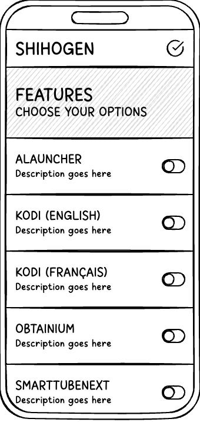
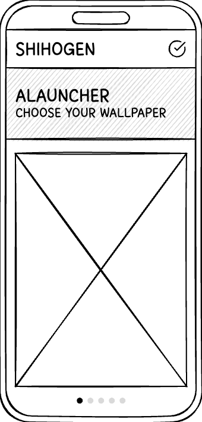
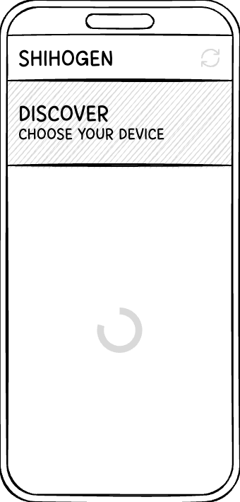
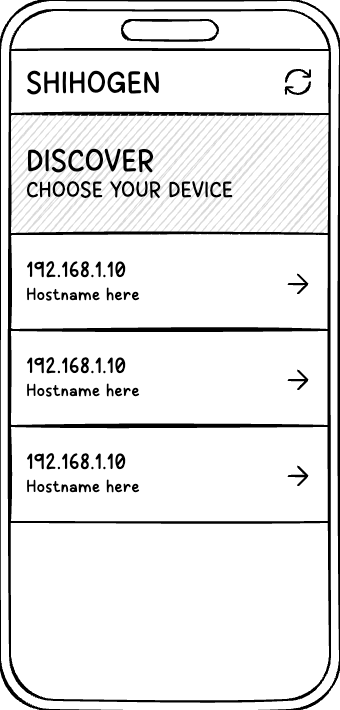
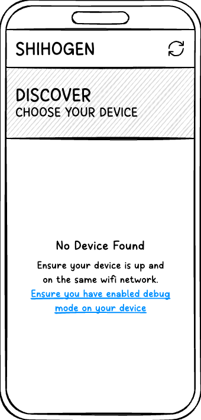
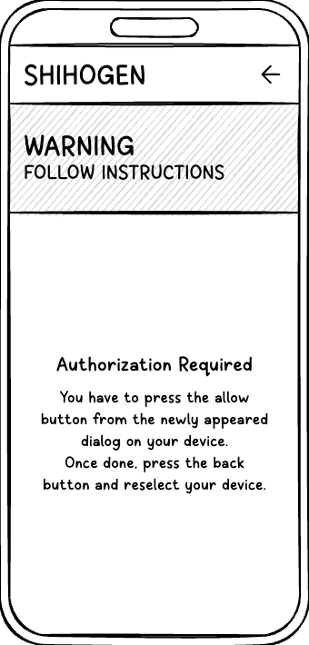
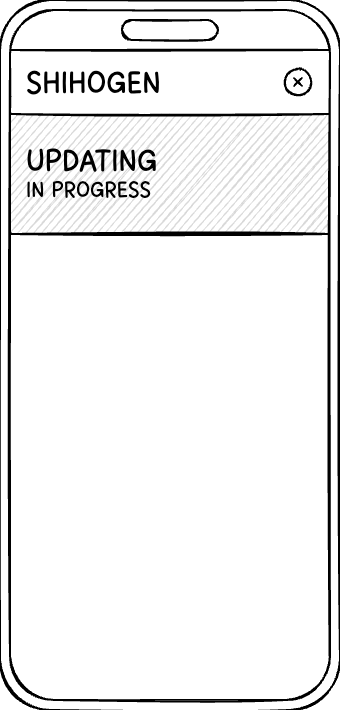

# OVERVIEW (WIP)

A Kotlin-based Android native application that integrates ADB (Android Debug Bridge) compiled for Android platforms, enabling remote app installation on Android TV devices directly from your mobile device. Currently supports Nvidia Shield 2019 as the target platform. This tool eliminates the need for a PC by running ADB commands natively on Android, allowing users to wirelessly deploy APKs and so on to their Shield TV through an intuitive mobile interface.

### Mobile Application

### Low Fidelity Mockup

<picture><source media="(prefers-color-scheme: dark)" srcset=".assets/shihogen-1-dark.png"></picture><picture><source media="(prefers-color-scheme: dark)" srcset=".assets/shihogen-2-dark.png"></picture><picture><source media="(prefers-color-scheme: dark)" srcset=".assets/shihogen-3-dark.png"></picture><picture><source media="(prefers-color-scheme: dark)" srcset=".assets/shihogen-4-dark.png"></picture>

<picture><source media="(prefers-color-scheme: dark)" srcset=".assets/shihogen-5-dark.png"></picture><picture><source media="(prefers-color-scheme: dark)" srcset=".assets/shihogen-6-dark.png"></picture><picture><source media="(prefers-color-scheme: dark)" srcset=".assets/shihogen-7-dark.png"></picture><picture><source media="(prefers-color-scheme: dark)" srcset=".assets/shihogen-8-dark.png"></picture>

