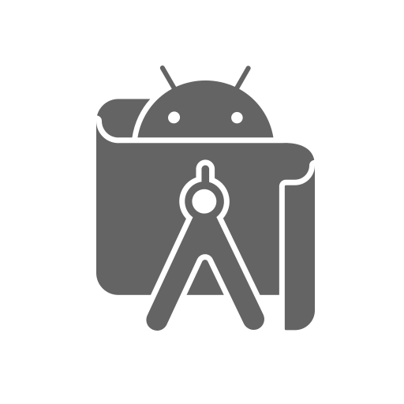
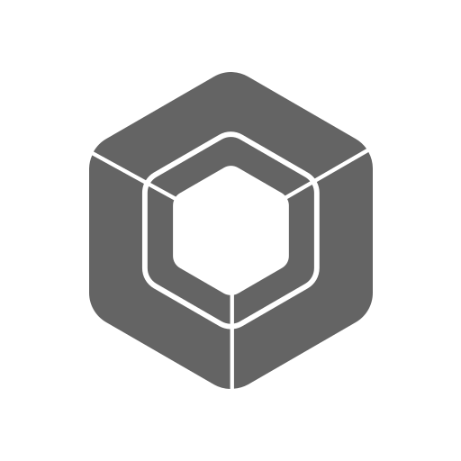
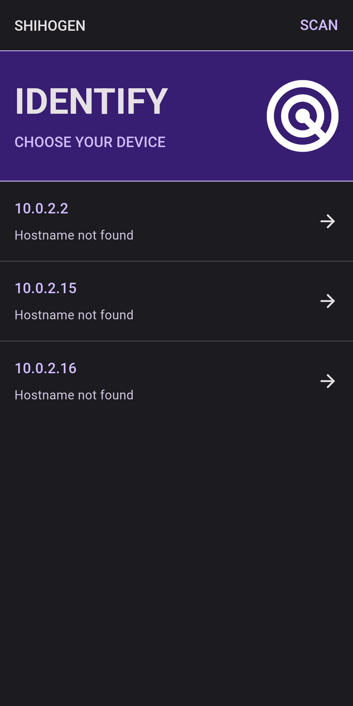
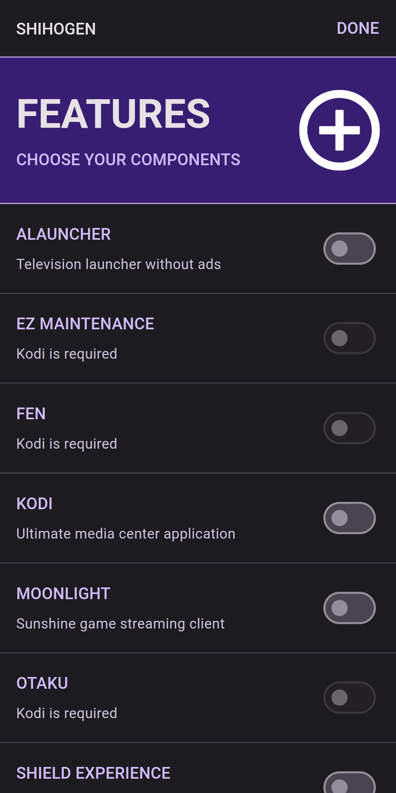
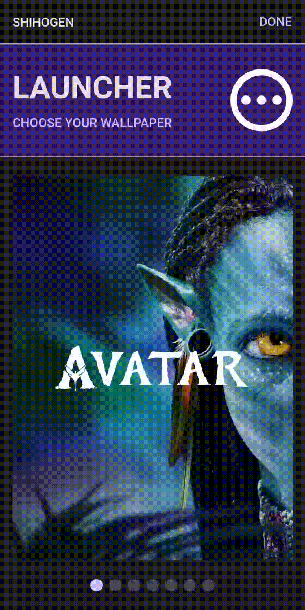
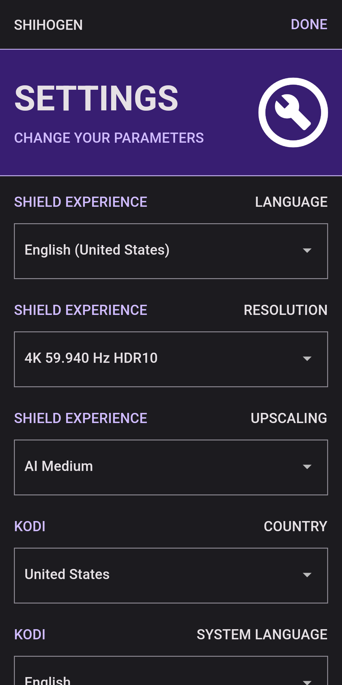
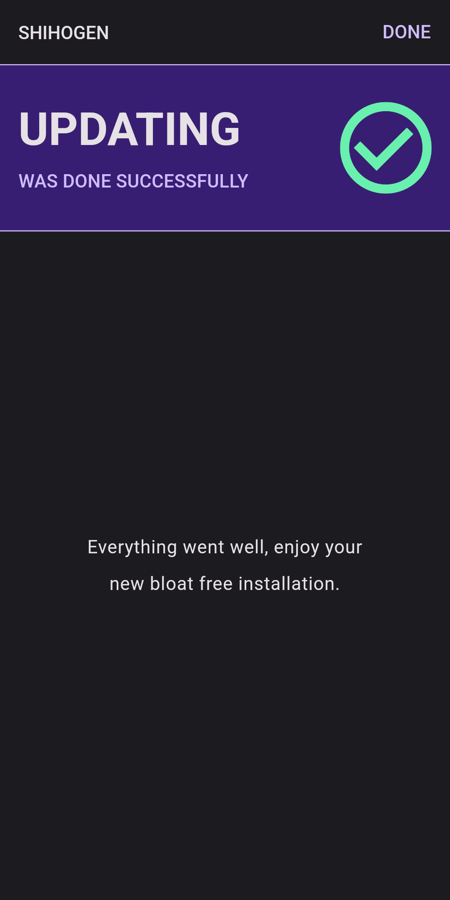

<div align="center">
  <p></p>
  <h1><code>SHIHOGEN</code></h1>
</div>

<table>
  <tbody><tr><td align="center" width="99999"><div>
    <a href="#">WEBSITE</a> ·
    <a href="#">FUNDING</a>
  </div></td></tr></tbody>
  <tbody><tr><td align="center" width="99999">&nbsp;<div>
    Turn your Android phone into a wireless ADB client for Android TV. Built in Kotlin with native ADB for Android, it lets you sideload APKs to Nvidia Shield 2019 without a PC via a clean mobile interface.
  </div>&nbsp;</td></tr></tbody>
  <tbody><tr><td align="center" width="99999">
    <a href="https://developer.android.com/studio"></a>
    <picture></picture>
    <a href="https://developer.android.com/compose"></a>
    <picture></picture>
    <a href="https://kotlinlang.org/"></a>
  </td></tr></tbody>
</table>

## PREVIEWS

<table><tbody><tr><td width="99999">
  <picture></picture><picture></picture><picture></picture><picture></picture>
</td></tr></tbody></table>

## FEATURES

<table>
  <tbody><tr><td width="99999">Lorem ipsum dolor sit amet</td><td>✅</td></tr></tbody>
  <tbody><tr><td>Curabitur sed tortor auctor</td><td>✅</td></tr></tbody>
  <tbody><tr><td>Vivamus et elit tincidunt</td><td>✅</td></tr></tbody>
  <tbody><tr><td>Phasellus vel convallis ultrices</td><td>✅</td></tr></tbody>
  <tbody><tr><td>Morbi sit amet sapien vel nulla</td><td>🚧</td></tr></tbody>
  <tbody><tr><td>Ut posuere odio nec volutpat</td><td>🚧</td></tr></tbody>
</table>

## RELEASES

<table>
  <tbody><tr>
    <td width="99999"><a href="#"></a></td>
    <td width="99999"><a href="#"></a></td>
    <td width="99999"><a href="#"></a></td>
  </tr></tbody>
</table>

## LEARNING

### DEBUG WITH ANDROID STUDIO

```sh
studio .
```

### DEBUG WITH INTELLIJ IDEA

```sh
idea .
```